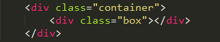

#页面布局中的居中问题

####导语
> 页面实现过程中不免会涉及到居中问题，每次遇到都会不自觉的去问问度娘，从来没有静下心来仔细研究一下这里面的门道。难得的空闲期，这里详细整理页面布局中常用的水平居中和垂直居中的方法。

##一、水平居中

###方法一 
**定义宽度**的**块级元素**，比如 `div` `p` `h1` 等，采用默认的position时，利用`marign:auto`来实现。

###方法二 
1. 对于**使用了绝对定位的块级元素**来说，当父元素与子元素宽度都固定时，定义 `left:(parentWidth - childWidth)/2`。

  

  

2. 对于**使用了绝对定位的块级元素**来说，当父元素与子元素有一方宽度不固定时，配合使用margin和left属性。
  * 子元素固定宽度：

  

  
  * 子元素百分比宽度

  

  

###方法三 
对于行级元素来说，比如 `span` `a` `img`等，利用`text-align:center`来实现。

##二、垂直居中